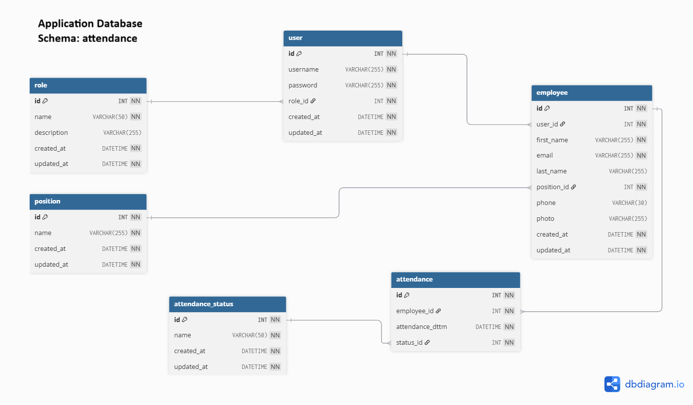
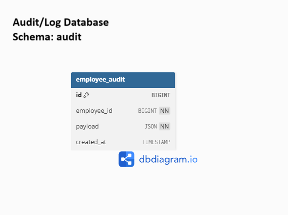

## Setup & Jalankan Project
```bash
git clone https://github.com/glenleedev/dexa-fullstack-test.git
cd dexa-fullstack-test
docker compose up -d
```

## Intro
Pengerjaan tech test ini menggunakan single repo agar mudah dijalankan. Tapi sebenarnya, di dalam repo ini terdapat tiga buah projects (**backend**, **frontend-employee**, **frontend-admin**). Menggunakan docker containers sebanyak 6 (esensial):
- backend
- db_app (MySQL)
- db_audit (MySQL)
- frontend_admin
- frontend_employee
- redpanda (event streaming)

dan 2 tambahan (mempermudah lihat data):
- phpmyadmin_app
- phpmyadmin_audit

## Stack yang Digunakan
- **Backend:** NestJS. Menggunakan **modular architecture** dengan pemisahan module sehingga mudah dikembangkan dan dapat di-scale menjadi **microservices** di masa depan. Menggunakan **Guards** pada endpoint untuk proteksi role (Admin/User) dan **TypeORM** untuk ORM.

- **Frontend:** React, MUI components, TailWind. Memiliki beberapa custom component.
- **Database:** MySQL InnoDB, baik untuk database aplikasi dan audit log.
- **Authentication:** Signed JSON Web Token (JWT).
- **Streaming:** Redpanda. Dipilih sebagai event streaming platform karena ringan, ini membuat setup untuk tech test lebih sederhana namun tetap kompatibel dengan ekosistem Kafka.


## Login & URL
| URL | Username | Password | Fitur |
|-----|----------|----------|-------|
| [http://localhost:3000](http://localhost:3000) | glen@dexagroup.com | password | Aplikasi attendance employee (check-in/out, lihat riwayat kehadiran, update profil). Admin juga dapat login dan absen seperti employee |
| [http://localhost:5000](http://localhost:5000) | admin@dexagroup.com | password | Aplikasi khusus admin (create & update employee, lihat semua attendance). Admin juga dapat mencari berdasarkan nama |
| [http://localhost:8080](http://localhost:8080) | - | - | PHPMyAdmin MySQL Aplikasi jika diperlukan |
| [http://localhost:8081](http://localhost:8081) | - | - | PHPMyAdmin MySQL Audit jika ingin melihat hasil logging perubahan profile |

## Database Diagrams



## API Endpoints

Daftar endpoint beserta fungsi singkatnya.

| #  | Method | Path | Roke | Deskripsi |
|----|--------|------|-------|-----------|
| 1  | POST   | /attendance/self         | Admin, Employee   | Record attendance (check-in/check-out) untuk user login |
| 2  | GET    | /attendance/self         | Admin, Employee   | Ambil daftar attendance milik user login (dengan pagination) |
| 3  | GET    | /attendance              | Admin | Ambil semua attendance (untuk admin, bisa filter/pagination) |
| 4  | POST   | /auth/login              | –              | Login, return JWT token |
| 5  | GET    | /employee/self           | Admin, Employee   | Ambil profil diri sendiri |
| 6  | GET    | /employee/master/position| Admin | Ambil daftar posisi (master data) |
| 7  | GET    | /employee/:id            | Admin | Ambil detail employee by ID |
| 8  | POST   | /employee                | Admin | Buat employee baru (admin harus createkan password awalnya) |
| 9  | DELETE | /employee/:id            | Admin | Hapus employee by ID |
| 10 | GET    | /employee                | Admin | Ambil semua employee (dengan filter name dan pagination) |
| 11 | PATCH  | /employee/self           | Admin, Employee   | Update profil diri sendiri (phone, password, photo). Jika ada perubahan akan di log (memanfaatkan Redpanda) |
| 12 | PATCH  | /employee/:id            | Admin | Update employee by ID (admin tidak bisa update password) |
| 13 | GET    | /user/master/role        | Admin | Ambil daftar role (master data) |

